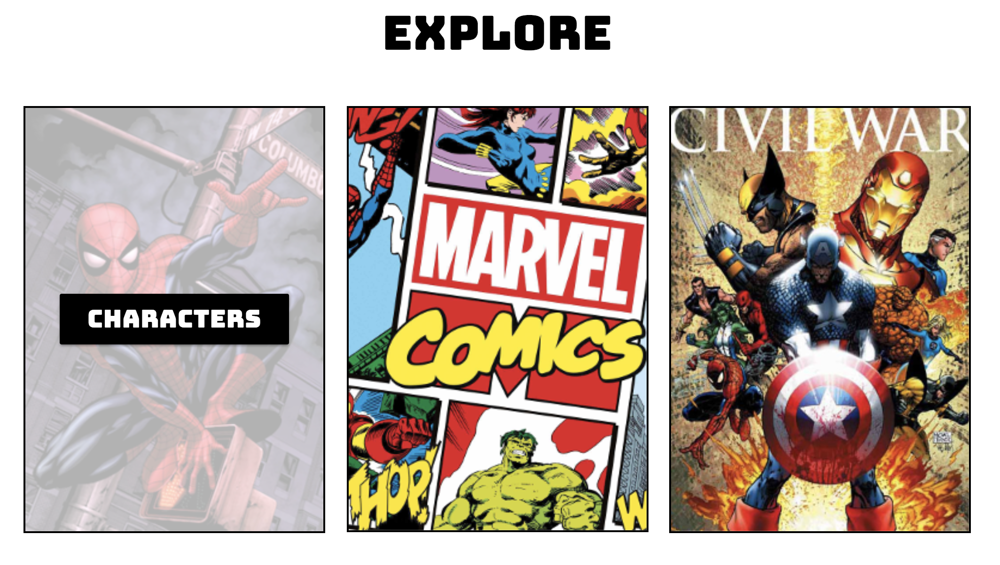

# Q1-Marvel-Database

A database to search for all things related to Marvel Comics.

## Table of Contents

- [Usage](#usage)
- [Support](#support)

## Usage

Open http://marve-comics-database.surge.sh

From here you can choose three pages from which you can search for the following:

- Characters
- Comics
- Events

You can navigate to any of these pages through a number of means:

- By clicking any of the navigation buttons in the header (on desktop):

- By clicking any of the explore images (on desktop or mobile): 

- By clicking any of the navigation buttons in the slide over (on mobile): 

On each of these pages you may search for and favorite your favorite characters, comics, or events for later access.

## Support

Please [open an issue](https://github.com/MrBurgo/Q1-Marvel-Database/issues) for support.
